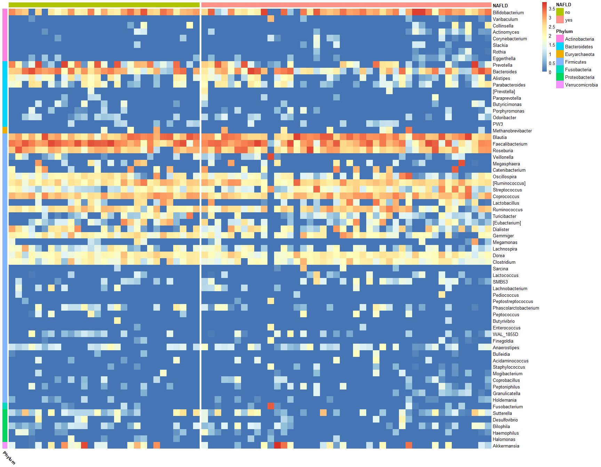

# Gut Microbiota and PNPLA3 in Pediatric NAFLD

[](https://zenodo.org/badge/latestdoi/235634627)

This repository contains the analysis code and data for the study:

> **Effect of gut microbiota and PNPLA3 rs738409 variant on non-alcoholic fatty liver disease (NAFLD) in obese youth**
>
> Kravetz AM, Testerman T, Galuppo B, Graf J, Piber E, Savarese M, Caprio S, Santoro N.
> *Journal of Clinical Endocrinology & Metabolism*, 2020.

## Overview

This study investigates the relationship between gut microbiota composition, the PNPLA3 rs738409 genetic variant, and non-alcoholic fatty liver disease (NAFLD) in a cohort of 73 obese youth. The analysis pipeline processes 16S rRNA gene sequencing data (V4 region) to characterize microbial communities and examine associations with NAFLD status.

## Repository Structure

```
.
├── scripts/
│   ├── qiime2_pipeline.sh              # QIIME2 processing pipeline
│   └── alpha_diversity_and_heatmap.Rmd # R analysis and visualization
├── data/
│   └── sample_metadata.txt             # Sample metadata (n=73)
├── figures/
│   ├── supplementary_figure_1_heatmap.png  # Publication figure
│   ├── heatmap_annotated.png               # Annotated heatmap with NAFLD grouping
│   └── heatmap_preliminary.png             # Preliminary clustered heatmap
└── README.md
```

## Analysis Pipeline

### 1. Sequence Processing (QIIME2)

The `scripts/qiime2_pipeline.sh` script performs:

- Import of paired-end Illumina FASTQ files
- Quality filtering and denoising with DADA2
- Chimera removal
- Sequence alignment (MAFFT) and phylogenetic tree construction (FastTree)
- Alpha and beta diversity analysis
- Taxonomic classification using Greengenes (99% OTU, V4 region) and Silva databases

**Requirements:** QIIME2 v2019.4 or later

### 2. Statistical Analysis (R)

The `scripts/alpha_diversity_and_heatmap.Rmd` script performs:

- Import of QIIME2 artifacts into phyloseq
- Rarefaction to 10,000 reads per sample
- Shannon Index alpha diversity calculation
- Genus-level taxonomic aggregation
- Hierarchical clustering and heatmap visualization

**Key R packages:**
- phyloseq (v1.26.1)
- qiime2R (v0.99.11)
- pheatmap (v1.0.12)
- tidyverse (v1.3.0)

## Data Description

### Sample Metadata (`data/sample_metadata.txt`)

Tab-delimited file containing 73 samples with the following key variables:

| Variable | Description |
|----------|-------------|
| sample_name | Unique sample identifier |
| NAFLD | NAFLD status (yes/no) |
| PNPLA3 | rs738409 genotype (CC, CG, GG) |
| host_age | Participant age |
| host_sex | Participant sex |
| host_body_mass_index | BMI |
| Hepatic_fat_fraction | Liver fat measurement |
| Fructose (kcal) | Dietary fructose intake |
| Sucrose (g) | Dietary sucrose intake |

### Required QIIME2 Outputs

The R analysis requires the following artifacts generated by the QIIME2 pipeline:

- `table.qza` - Feature (ASV) table
- `taxonomy.qza` - Taxonomic classifications
- `rooted-tree.qza` - Phylogenetic tree

## Usage

### Running the QIIME2 Pipeline

```bash
# Activate QIIME2 environment
conda activate qiime2-2019.4

# Run the pipeline (interactive prompts for paths)
bash scripts/qiime2_pipeline.sh
```

### Running the R Analysis

```r
# Open in RStudio and knit, or run:
rmarkdown::render("scripts/alpha_diversity_and_heatmap.Rmd")
```

## Output

The primary output is **Supplementary Figure 1** (`figures/supplementary_figure_1_heatmap.png`), a hierarchical clustered heatmap showing:

- Genus-level microbial abundance across all samples
- Samples grouped by NAFLD status
- Taxa annotated by phylum



## Citation

If you use this code or data, please cite:

```bibtex
@article{kravetz2020effect,
  title={Effect of gut microbiota and PNPLA3 rs738409 variant on non-alcoholic fatty liver disease (NAFLD) in obese youth},
  author={Kravetz, AM and Testerman, T and Galuppo, B and Graf, J and Piber, E and Savarese, M and Caprio, S and Santoro, N},
  journal={Journal of Clinical Endocrinology \& Metabolism},
  year={2020}
}
```

## License

This repository is made available for academic and research purposes. Please contact the authors for commercial use inquiries.

## Contact

For questions about the analysis code, please open an issue in this repository.
